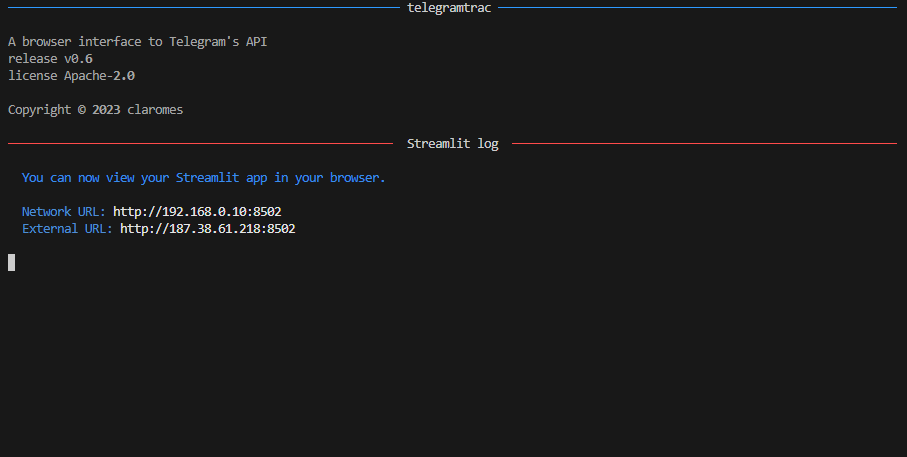
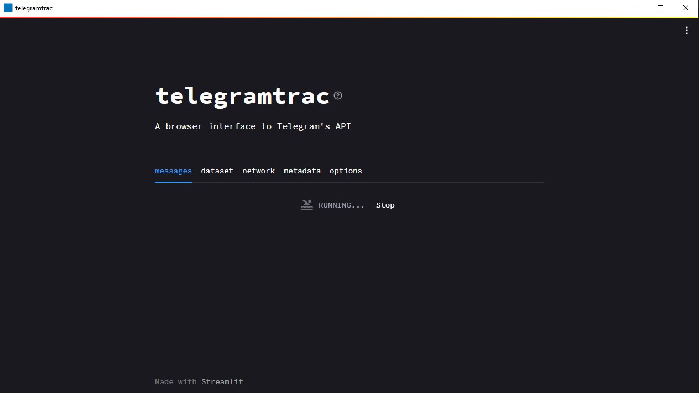
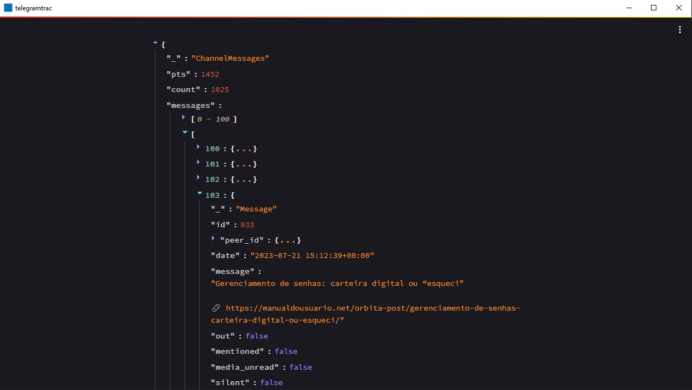
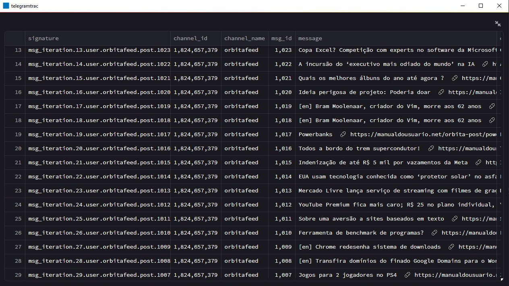
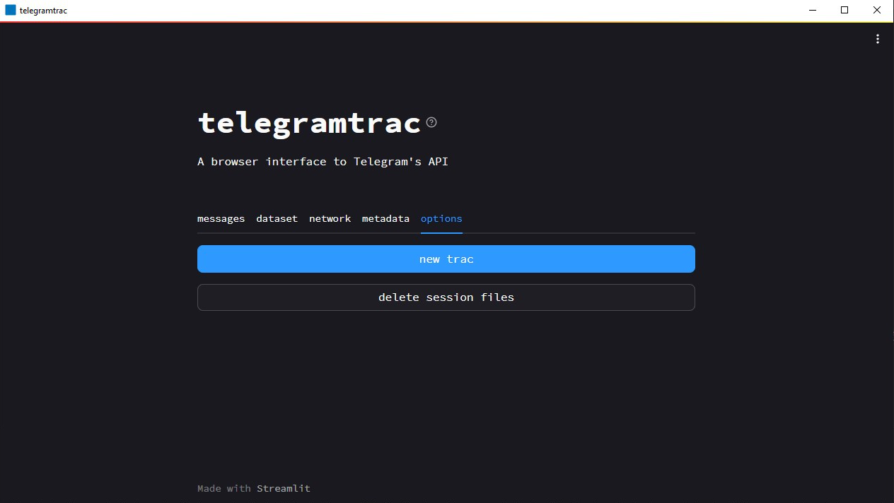

# 🟦 telegramtrac

 

A browser interface to Telegram’s API. Provides modules for connecting, signing in and communicating via Telethon. Generates files containing messages and metadata. It also includes additional modules for data analysis. telegramtrac is a fork of the Python package Telegram Tracker.

## Serverless (Desktop App)

> [!NOTE]
> The application can be resource-intensive, and the free Streamlit Cloud Community option is not sufficient. Therefore, I decided to compile telegramtrac to run locally. It is not necessary to configure any development environment; simply run as administrator the telegramtrac.exe file.

### Download

- Windows x64

### Built with

- Streamlit 1.25.0
- Nuitka 1.7.3 (standalone mode)
- Inno Setup 6.2.2

### Usage

1. Create your API credentials [here](https://my.telegram.org/auth)

2. Enter the input `api_id`, `api_hash` and `phone` (e.g., +55912348765), then click on the `send credentials` button

- A 5-digit code will be send to your Telegram app

3. Enter the input `code` and `password` (optional), then click on the `sign in` button

- A confirmation message will be send to your Telegram app

4. Enter the input `channels (semicolon separated)`, then click on the `trac` button

- It may take a few minutes...

5. Switch tabs to preview or download the data

7. To finish and delete all credentials/session files, click on the `delete session files` button

### Screenshots

    
    

    <i>Log (OS console/prompt) and login</i>

 

    
    

    <i>Tracking and messages visualization</i>

 

    
    

    <i>Dataset visualization and new tracking/logoff</i>

 

## Cloud

The application is also available on [Streamlit Community Cloud](https://telegramtrac.streamlit.app) with limited server resources. The source code is available in the branch [`cloud`](https://github.com/claromes/telegramtrac/tree/cloud).

## Development

### Requirements

- Operating System: Windows 64 bits
- Python 3.8+
- C Compiler
    - MSVC 14.3 (`--onefile mode`)
- Make (optional)

### Installation

$ `git clone git@github.com:claromes/telegramtrac.git`

$ `cd telegramtrac`

$ `pip install -r requirements.txt`

$ `python telegramtrac.py`

The Streamlit main file is `app.py`.

Streamlit will be served at http://localhost:8502

### Build with Nuitka (Python compiler)

- --onefile mode

    $ `make onefile`

- --standalone mode

    $ `make standalone`

- non-distributable executable mode

    >[!NOTE]
    >To use the target `dev`, change `app_path` variable in telegramtrac.py file to `app_path_dev`

    $ `make dev`

Reference:
- [Nuitka User Manual](https://nuitka.net/doc/user-manual.html)

### Installer configuration with Inno Setup

References:

- [Inno Setup Documentation](https://jrsoftware.org/ishelp.php)
- [blog.pythonlibrary.org](https://www.blog.pythonlibrary.org/2019/03/19/distributing-a-wxpython-application/) (topic: Creating an Installer with Inno Setup)

## Docs

- [Roadmap](docs/ROADMAP.md)
- [Changelog](docs/CHANGELOG.md)