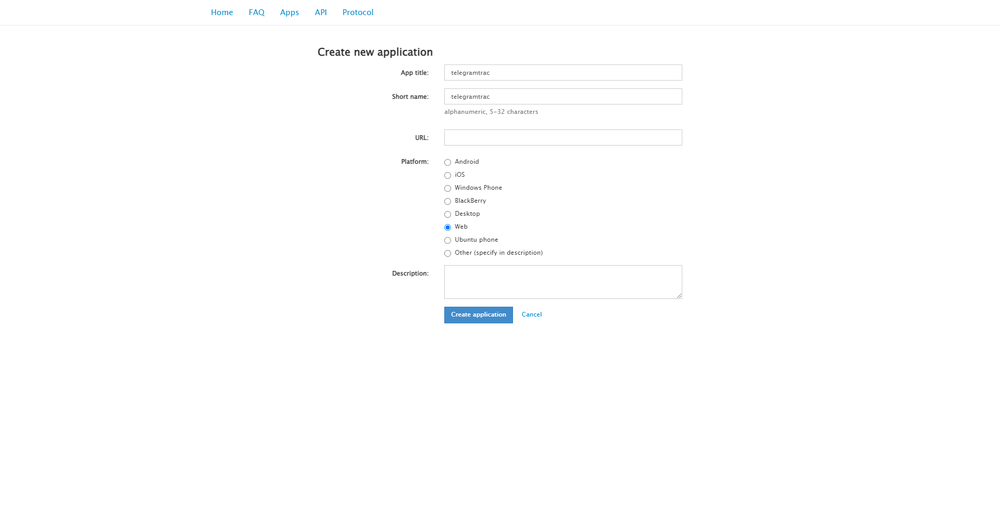

# telegramtrac

 (not stable)

## Team Members
[claromes](https://claromes.gitlab.io/)

## Tool Description
telegramtrac is a web-based tool designed for tracking public channels on Telegram. It's a fork of the Python package [`telegram-tracker`](https://github.com/estebanpdl/telegram-tracker) developed by Esteban Ponce de León, DFRLab researcher.

I became familiar with the package during the DFRLab's Digital Sherlocks Program and believe that an accessible version would benefit researchers of different skill levels.

## Installation

### Requirements

- Python 3.8+

### Dev

$ `git clone git@github.com:claromes/telegramtrac.git`

$ `cd telegramtrac`

$ `pip install -r requirements.txt`

$ `streamlit run streamlit\telegramtrac.py`

Streamlit will be served at http://localhost:8501

## Usage

### Browser interface

 

> Initial screen: credentials, sign in and channel inputs
 

    

 

> Data screens: tabs and download links
 

    

    

    

    

**network tab is under development*
 

    

 

> Restart tab: to track another channel
 

    

### Workflow

*IMPORTANT: To test using the deploy link with your personal credentials disable the 2FA*

1. Create your API credentials [here](https://my.telegram.org/auth)

    

    

2. Fill the inputs `api_id`, `api_hash` and your `phone` number (*following this format: +5500912348765*) and click on `send credentials` button

- It may take a few minutes...

- A 5-digit code will be send to your Telegram app

3. Fill the input `code` and click on `sign in` button

4. Fill the input `channel name` (*copy name from channel link: t.me/CHANNEL_NAME*) and click on `trac` button

- A message will be send to your Telegram app about the authentication

- It may take a few minutes...

5. Switch tabs to preview or download the data

6. To track another channel, switch to last tab (`trac`) and click `restart`.

- To restart, send the same credentials and `code`
- A late message could be send to your Telegram app about other authentications
- At each tracking the dataset are grouped in the same file to allow network analysis

## Additional Information

### Limitations

- Unable to use with 2FA
- Only one channel per track

### Design decisions

Mostly limited to Streamlit options. The form and tabs were chosen due to common use in web apps.

## Roadmap

- [x] Fix dataset tab
- [ ] Fix set credentials and code in restart flow
- [ ] Network tab
- [ ] Error msgs
- [ ] Storage limit alerts
- [ ] Allow 2FA
- [ ] Add batch file upload
- [ ] Option without API credentials
- [ ] Log for users
- [ ] Logout users
- [ ] Docs telegramtrac/ API credentials (how to)
- [ ] Refactor the code
- [ ] Check API limitations
- [ ] Sec issues

## Changelog

- [v0.2.0](https://github.com/claromes/telegramtrac/releases/tag/v0.2.0)
    - Fix dataset tab
    - Fix imports
- [v0.1.0](https://github.com/claromes/telegramtrac/releases/tag/v0.1.0)
    - Bellingcat Accessiblilty Hackathon submission

## Telegram App Bans in Brazil

Due to the blocking of Telegram in Brazil ([NYT article](https://www.nytimes.com/2023/04/26/briefing/brazil-telegram-ban.html)), which has already occurred on other occasions, I decided to expand the development and include in the roadmap an option without API credentials