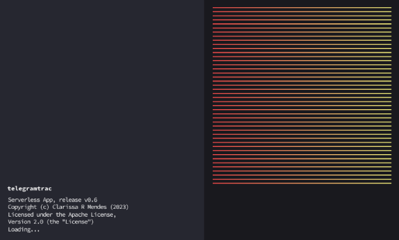
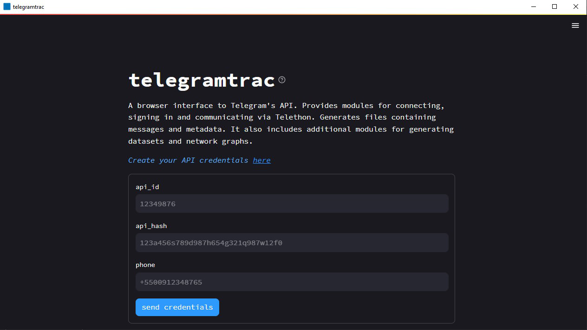
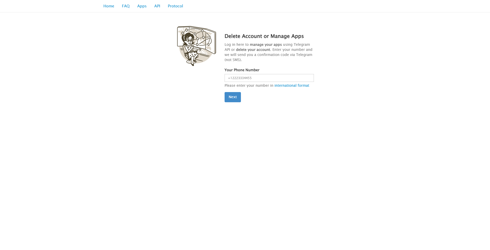
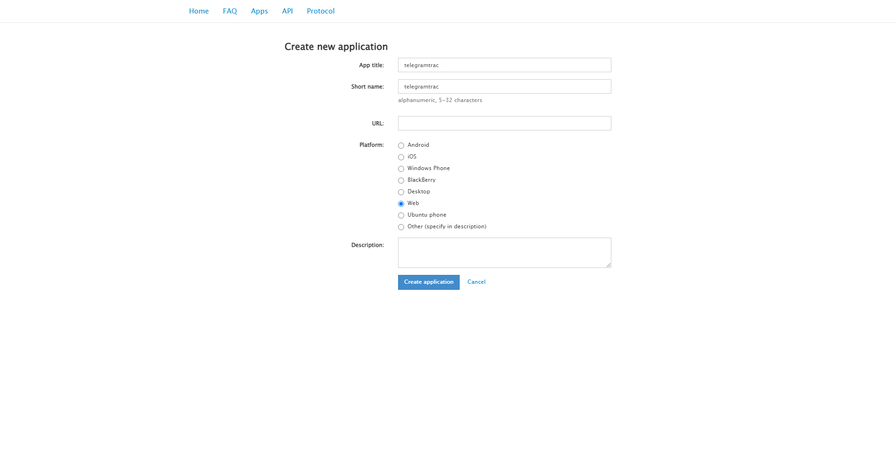

# telegramtrac

  

A browser interface to Telegram’s API. Provides modules for connecting, signing in and communicating via Telethon. Generates files containing messages and metadata. It also includes additional modules for generating datasets and network graphs.

It's a fork of [Telegram Tracker](https://github.com/estebanpdl/telegram-tracker).

 
 

    

    <i>Splash screen</i>

 
 

    

    <i>Login</i>

## Desktop (Serverless App)

*The application can be resource-intensive, and the free Streamlit Cloud Community option is not sufficient. Therefore, I decided to compile telegramtrac to run locally. It is not necessary to configure any development environment; simply run the telegramtrac.exe file.*

### Requirement

- Python 3.8+

### Download

- Windows 10: [telegramtrac-0.6.zip]()

Extract the contents of the ZIP folder to access the bundled content, and then run it.

### Folder structure

<code>./config</code>

    Telegram API credentials file (.ini)

<code>./output_API_ID</code>

    Telegram channel files (.json, .csv, .xlsx, .txt)

<code>./session</code>

    Telegram API session files (.session and .session-journal)

<code>./sign_in</code>

    Telegram API code and password encrypted files (.bin)

<code>telegramtrac.exe</code>

    telegramtrac's executable file

## Cloud

The application is also available on [Streamlit Community Cloud](https://telegramtrac.streamlit.app) with limited server resources.

## Usage

1. Create your API credentials [here](https://my.telegram.org/auth)

    

    

2. Enter the input `api_id`, `api_hash` and `phone` (e.g., +55912348765), then click on the `send credentials` button

- A 5-digit code will be send to your Telegram app

3. Enter the input `code` and `password` (optional), then click on the `sign in` button

- A confirmation message will be send to your Telegram app

4. Enter the input `channel name` (*t.me/CHANNEL_NAME_IS_HERE*), then click on the `trac` button

- It may take a few minutes...

5. Switch tabs to preview or download the data

6. To tracking another channel, switch to last tab (`trac`) and click `new trac`.

    6.1. Enter the input `channel name` (*t.me/CHANNEL_NAME_IS_HERE*), then click on the `trac` button

7. To finish and delete all credentials/session/code/password, click on the `log out` button

- At each tracking the dataset are grouped in the same file to allow network analysis

## Additional Information

### Limitations

- Only one channel per tracking

### Design decisions

Mostly limited to Streamlit options

## Development

### Requirements

- Python 3.8+
- Make
- MSVC 14.3
- Ccache *(optional)*

### Installation

$ `git clone git@github.com:claromes/telegramtrac.git`

$ `cd telegramtrac`

$ `pip install -r requirements.txt`

### Cloud version

$ `streamlit run cloud-app.py`

Streamlit will be served at http://localhost:8502

### Desktop version

$ `python telegramtrac.py`

The Streamlit main file is `app.py`

Streamlit will be served at http://localhost:8502

### Build with Nuitka (Python compiler)

- --onefile

    $ `make onefile`

- --onefile (with console enabled)

    $ `make onefile console`

- --standalone

    $ `make standalone`

- --standalone (with console enabled)

    $ `make standalone console`

- test

    $ `make test`

[Nuitka User Manual](https://nuitka.net/doc/user-manual.html)

## Bugs

- Desktop
    - [ ] Warnings:
        - UserWarning: loaded more than 1 DLL from .libs
    - [x] Close console

- Streamlit Cloud
    - [ ] "sqlite3.OperationalError: database is locked" issue on long-running requests
        - Do not displays requested data and instead  "new trac" component
    - [ ] `requirements.txt` installation on Streamlit Cloud

## Roadmap

- [x] Fix dataset tab
- [x] Fix set credentials and code in restart flow
- [x] Allow 2FA
- [x] One session/sign_in file per user
- [x] Generic error msgs
- [x] Delete files after session finish
- [x] Add download
    - [x] `collected_chats.xlsx`
    - [x] `user_exceptions.txt`
- [ ] Executable file
- [x] Add message about output folder (Desktop)
- [x] Keep *output_api_id* folder (Desktop)
- [x] Metadata files with channel name
- [ ] GitHub Actions
- [x] Makefile to build/test
- [ ] Serverless App without Python installed
- [ ] Encrypt config file
- [ ] Check login
- [ ] Multiples channels
- [ ] Network tab
- [ ] Submit typing Enter
- [ ] Delete `subprocess.check_output`/ Update dir structure
    - [ ] Use `trio` instead of `asyncIO`
- [ ] Screen Splash (C compiler issue)
- [ ] Loading process explicit
- [ ] `DtypeWarning` (dataset)
- [ ] Check API limitations (FloodWaitError)
- [ ] Error msgs
    - [ ] FloodWaitError
    - [ ] Wrong password
    - [ ] Channel not found
- [ ] Build for Debian/Ubuntu/Mint
- [ ] Logout users (via Telethon)
- [ ] Option without API credentials

## [Changelog](/CHANGELOG.md)
