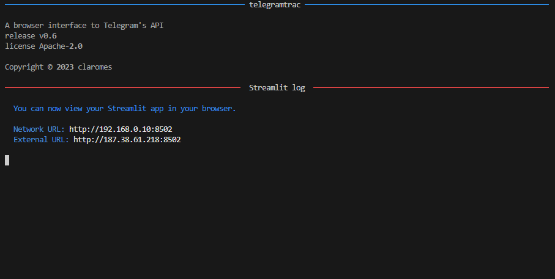
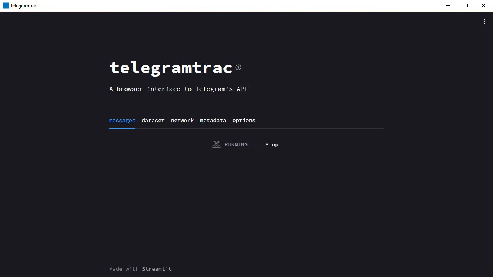
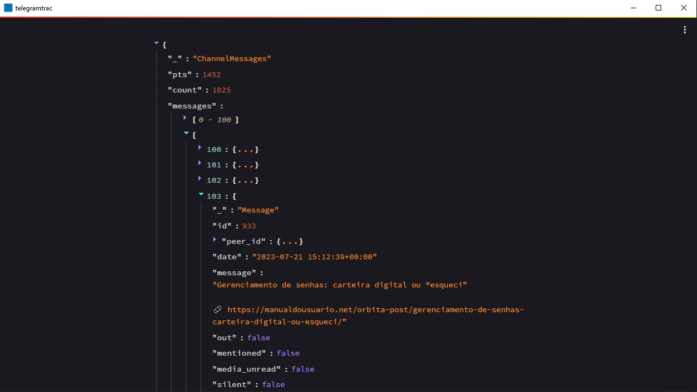
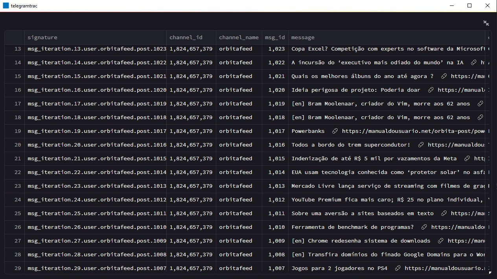
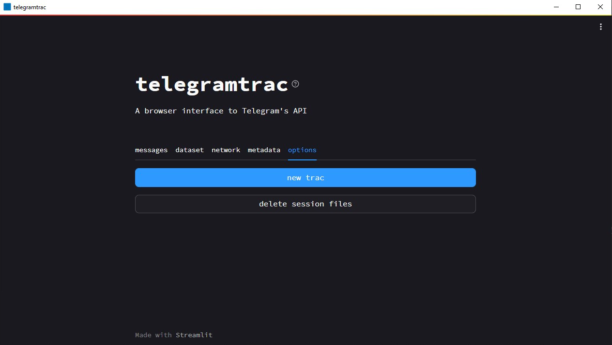

# 🟦 telegramtrac

 

A browser interface to Telegram’s API. Provides modules for connecting, signing in and communicating via Telethon. Generates files containing messages and metadata. It also includes additional modules for data analysis. telegramtrac is a [Telegram Tracker](https://github.com/estebanpdl/telegram-tracker) fork.

## Serverless (Desktop App)

> [!NOTE]
> The application can be resource-intensive, and the free Streamlit Cloud Community option is not sufficient. Therefore, I decided to compile telegramtrac to run locally. It is not necessary to configure any development environment; simply run as administrator the telegramtrac.exe file.

### Download

- Windows x64: [telegramtrac-0.6-installer-win-x64](download/telegramtrac-0.6-installer-win-x64.exe)

[Usage instructions](#usage)

### Built with

- Streamlit 1.25.0
- Nuitka 1.7.3 (standalone mode)
- Inno Setup 6.2.2

### Screenshots

    
    

    <i>Log (OS console/prompt) and login</i>

 

    
    

    <i>Tracking and messages visualization</i>

 

    
    

    <i>Dataset visualization and new tracking/logoff</i>

 

## Cloud

The application is also available on [Streamlit Community Cloud](https://telegramtrac.streamlit.app) with limited server resources.

## Usage

1. Create your API credentials [here](https://my.telegram.org/auth)

    
    

2. Enter the input `api_id`, `api_hash` and `phone` (e.g., +55912348765), then click on the `send credentials` button

- A 5-digit code will be send to your Telegram app

3. Enter the input `code` and `password` (optional), then click on the `sign in` button

- A confirmation message will be send to your Telegram app

4. Enter the input `channel name` (*t.me/CHANNEL_NAME_IS_HERE*), then click on the `trac` button

- It may take a few minutes...

5. Switch tabs to preview or download the data

6. To tracking another channel, switch to the last tab (`trac`) and click `new trac`.

    6.1. Enter the input `channel name` (*t.me/CHANNEL_NAME_IS_HERE*), then click on the `trac` button

7. To finish and delete all credentials/session files, click on the `log out` button

- At each tracking the dataset are grouped in the same file to allow network analysis

## Additional Information

### Limitations

- Only one channel per tracking

### Design decisions

Mostly limited to Streamlit options

## Development

### Requirements

- Operating System: Windows 64 bits
- Python 3.8+
- C Compiler
    - MSVC 14.3 (`--onefile mode`)
- Make (optional)

### Installation

$ `git clone git@github.com:claromes/telegramtrac.git`

$ `cd telegramtrac`

### Cloud version

$ `pip install -r requirements.txt`

$ `streamlit run app.py`

Streamlit will be served at http://localhost:8501

### Serverless version

$ `pip install -r requirements-build.txt`

$ `python telegramtrac.py`

The Streamlit main file is `app.py`.

Streamlit will be served at http://localhost:8502

### Build with Nuitka (Python compiler)

- --onefile mode

    $ `make onefile`

- --standalone mode

    $ `make standalone`

- non-distributable executable mode

    >[!NOTE]
    >To use the target `dev`, change `app_path` variable in telegramtrac.py file to `app_path_dev`

    $ `make dev`

Reference:
- [Nuitka User Manual](https://nuitka.net/doc/user-manual.html)

### Installer configuration with Inno Setup

References:

- [Inno Setup Documentation](https://jrsoftware.org/ishelp.php)
- [blog.pythonlibrary.org](https://www.blog.pythonlibrary.org/2019/03/19/distributing-a-wxpython-application/) (topic: Creating an Installer with Inno Setup)

## Bugs

- Serverless
    - [x] Warnings:
        - UserWarning: loaded more than 1 DLL from .libs
    - [x] Close console

- Streamlit Cloud
    - [ ] "sqlite3.OperationalError: database is locked" issue on long-running requests
        - Do not displays requested data and instead  "new trac" component
    - [ ] `requirements.txt` installation on Streamlit Cloud

## Roadmap

- [x] Fix dataset tab
- [x] Fix set credentials and code in restart flow
- [x] Allow 2FA
- [x] One session/sign_in file per user
- [x] Generic error msgs
- [x] Delete files after session finish
- [x] Add download
    - [x] `collected_chats.xlsx`
    - [x] `user_exceptions.txt`
- [x] Executable file
- [x] Add message about output folder (Desktop)
- [x] Keep *output_api_id* folder (Desktop)
- [x] Metadata files with channel name
- [x] Makefile to build/test
- [x] Serverless App without Python installed
- [x] Set up installer
- [ ] Set `Download` dir as output dir
- [ ] Inno Setup docs
- [ ] Folder structure docs
- [ ] Check login
- [ ] Loading process explicit
- [ ] Encrypt config file
- [ ] Multiples channels
- [ ] Network tab
- [x] Submit typing Enter
- [ ] Delete `subprocess.check_output`/ Update dir structure
    - [ ] Use `trio` instead of `asyncIO`
- [x] Splash screen (C compiler issue)
- [ ] `DtypeWarning` (dataset)
- [ ] Error msgs
    - [ ] FloodWaitError
    - [ ] Wrong password
    - [ ] Channel not found
- [ ] Build for Debian/Ubuntu/Mint
- [ ] Logout users (via Telethon)
- [ ] Option without API credentials

## [Changelog](/CHANGELOG.md)
