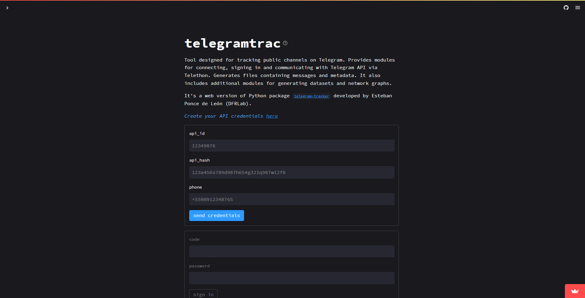
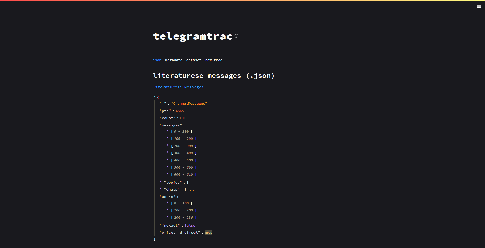
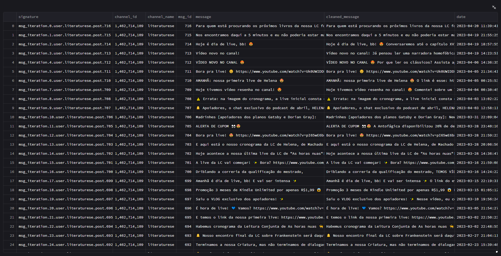
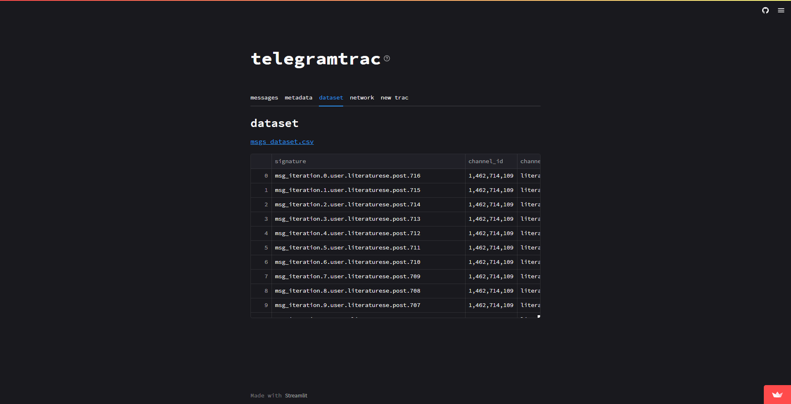
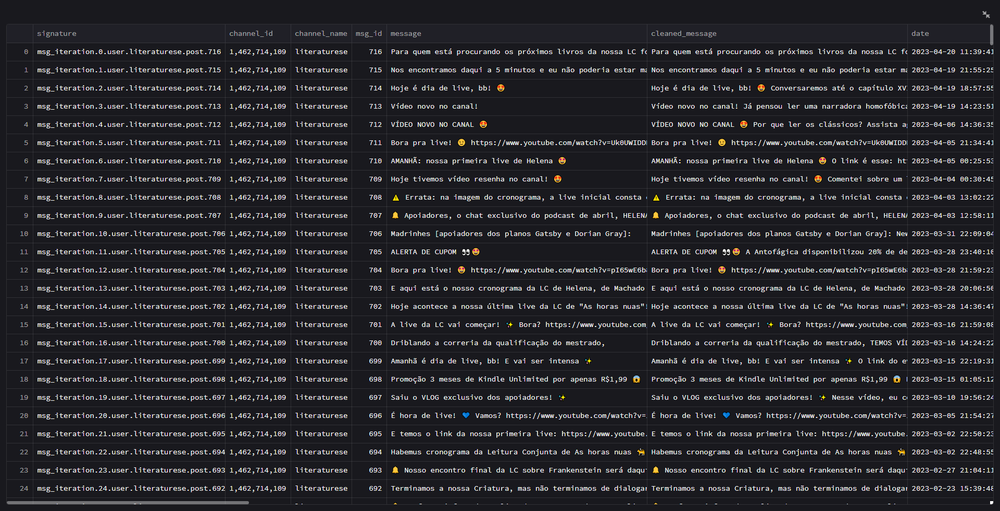
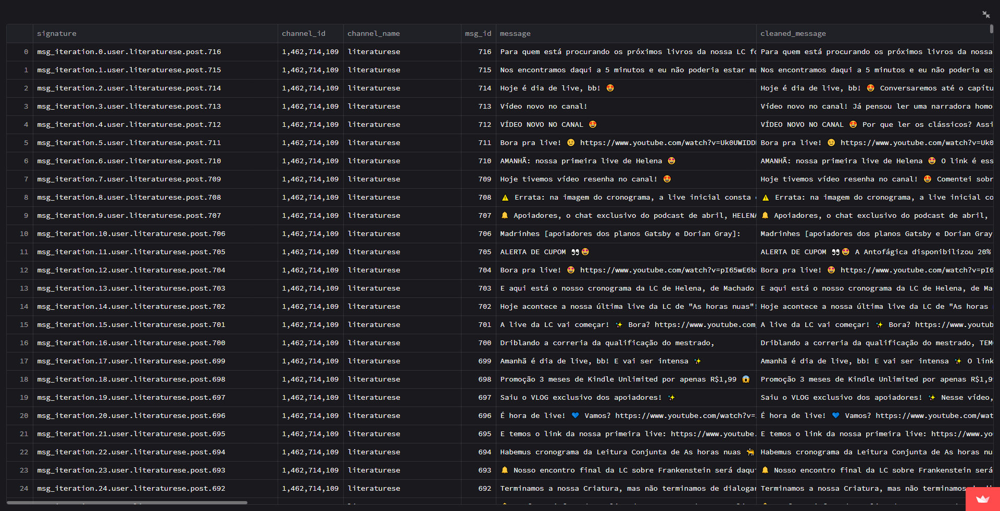
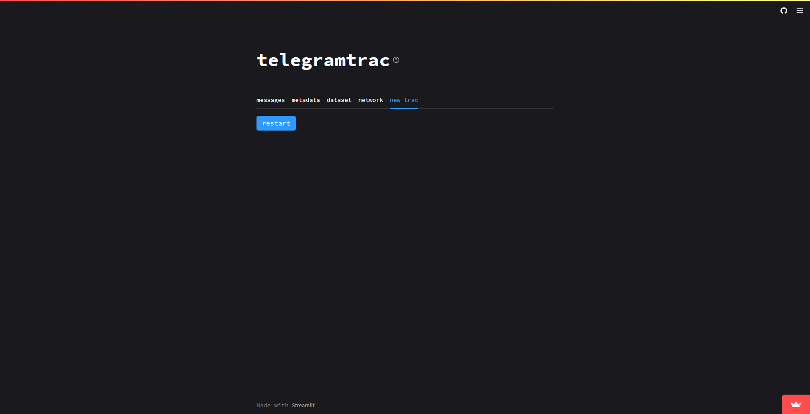
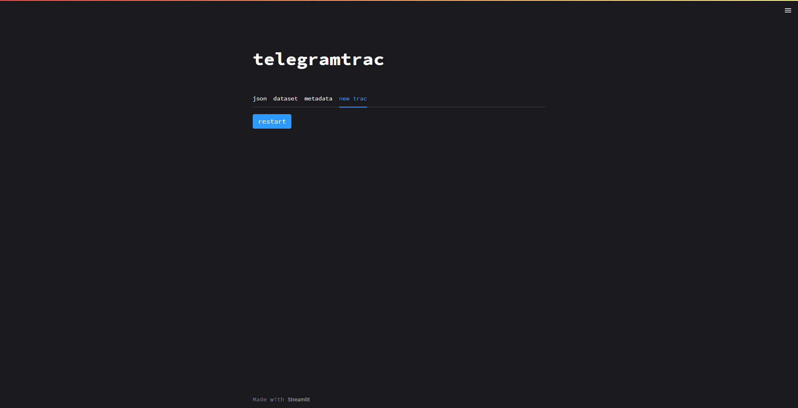

*After the event the tool will be under development*

# telegramtrac

## Team Members
[claromes](https://claromes.gitlab.io/)

## Tool Description
telegramtrac is a Telegram public channels tracker designed for non-programmers. It is a web version of Telegram Tracker, a Python package that allows users to track a channel messages. The original tool facilitates channel tracking and includes features such as visualizing a network graph and metadata.

I discovered the original package during a DFRLab's Digital Sherlocks workshop. It is already being used by experienced researchers, and an accessible version would allow researchers of different skill and experience levels to track Telegram.

The package was developed by researcher Esteban Ponce de León as part of the Digital Sherlocks community, and as a member of this community, I want to contribute!

telegramtrac can also contribute to the open source ecosystem of the OSINT community.

## Installation

### Deploy

[telegramtrac.streamlit.app](https://telegramtrac.streamlit.app/) (not stable)

### Development

#### Requirements

- Python 3.8+

#### Build

$ `git clone git@github.com:claromes/telegramtrac.git`

$ `cd telegramtrac`

$ `pip install -r requirements.txt`

$ `streamlit run streamlit\telegramtrac.py`

Streamlit will be served at http://localhost:8501

## Usage
### Browser interface

 

> Initial screen: credentials, sign in and channel input
 

    

 

> Data screen: tabs and download links
 

    

    

**dataset tab is under repair*

    

    

 

> Restart tab: to track another channel
 

    

### Workflow

*IMPORTANT: To test using the deploy link with your personal credentials disable the 2FA*

1. Create your API credentials [here](https://my.telegram.org/auth)

    

    

2. Fill the inputs `api_id`, `api_hash` and your `phone` number (*following this format: +5500912348765*) and click on `send credentials` button

- It may take a few minutes...

- A 5-digit code will be send to your Telegram app

3. Fill the input `code` and click on `sign in` button

4. Fill the input `channel name` (*copy name from channel link: t.me/CHANNEL_NAME*) and click on `trac` button

- A message will be send to your Telegram app about the authentication

- It may take a few minutes...

5. Switch tabs to preview or download the data

6. To track another channel, switch to last tab (`trac`) and click `restart`.

- To restart, send the same credentials and send de same `code`
- A late message could be send to your Telegram app about other authentications
- At each tracking the dataset are grouped in the same file to allow network analysis

## Additional Information

### Limitations

- Unable to use with 2FA
- Only one channel per track
- Only grouped data

### Design decisions

Mostly limited to Streamlit options. The form and tabs were chosen due to common use in web apps.

### Roadmap

- [ ] Fix dataset tab
- [ ] Log for users
- [ ] Docs telegramtrac/ API credentials (how to)
- [ ] Refactor the code
- [ ] Improve About section
- [ ] Allow other package options
- [ ] Check API limitations
- [ ] Add batch file upload
- [ ] Logout users
- [ ] Sec issues
